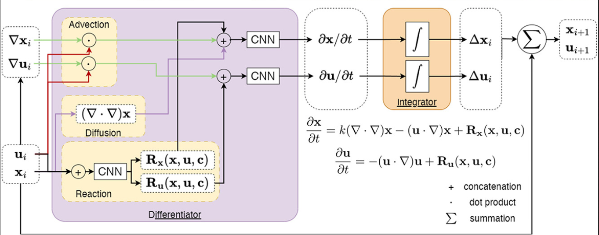

# PARCtorch
Physics-aware Recurrent Convolutional Neural Networks (PARCv2) in PyTorch

[Documentation](https://parctorch.readthedocs.io/en/latest/index.html)



Paper link: [arxiv](https://arxiv.org/abs/2402.12503) [ICML 2024 Proceedings](https://proceedings.mlr.press/v235/nguyen24c.html)

### Highlight


### Citation

If you find our research helpful, please consider citing us with：
```
@InProceedings{pmlr-v235-nguyen24c,
  title = 	 {{PARC}v2: Physics-aware Recurrent Convolutional Neural Networks for Spatiotemporal Dynamics Modeling},
  author =       {Nguyen, Phong C.H. and Cheng, Xinlun and Azarfar, Shahab and Seshadri, Pradeep and Nguyen, Yen T. and Kim, Munho and Choi, Sanghun and Udaykumar, H.S. and Baek, Stephen},
  booktitle = 	 {Proceedings of the 41st International Conference on Machine Learning},
  pages = 	 {37649--37666},
  year = 	 {2024},
  editor = 	 {Salakhutdinov, Ruslan and Kolter, Zico and Heller, Katherine and Weller, Adrian and Oliver, Nuria and Scarlett, Jonathan and Berkenkamp, Felix},
  volume = 	 {235},
  series = 	 {Proceedings of Machine Learning Research},
  month = 	 {21--27 Jul},
  publisher =    {PMLR},
  pdf = 	 {https://raw.githubusercontent.com/mlresearch/v235/main/assets/nguyen24c/nguyen24c.pdf},
  url = 	 {https://proceedings.mlr.press/v235/nguyen24c.html}
}
```
